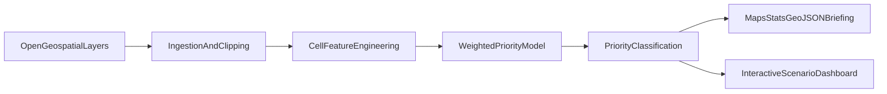

# Saskatchewan Habitat Prioritization

Portfolio project aligned to the Saskatchewan Ministry of Environment Habitat Analyst role (PCAN-style conservation prioritization).

## Project Goal

Build a transparent decision-support workflow that answers:

**"Given limited time and resources, which land areas should be prioritized first for conservation, and why?"**

This project does not make final legal decisions.  
It produces data-driven rankings to support planners, analysts, and leadership.

## Problem This Solves

- Conservation resources are limited.
- Land-use pressure is high (roads, settlements, development).
- Decision-makers need objective, repeatable, map-based evidence.

This system ranks grid cells into:
- `High` priority (protect first),
- `Medium` priority (review and compare),
- `Low` priority (lower immediate conservation value).

## Screenshot

## Architecture

## End-to-End Flow

1. Define pilot extent and analysis settings in `configs/project_config.yaml`.
2. Download and clip source layers to the pilot region (`src/build_real_features.py`).
3. Build cell-level feature table (biodiversity proxy, wetland density, disturbance, etc.).
4. Score each cell using weighted factors (`src/run_pipeline.py`).
5. Classify cells by quantile thresholds: High / Medium / Low.
6. Export map/statistical outputs and briefing artifacts.
7. Generate interactive dashboard for policy scenario testing (`src/build_dashboard.py`).

## Data Sources

### Current operational data (open and reproducible)

Used in this repository right now:

- Lakes: `https://naturalearth.s3.amazonaws.com/10m_physical/ne_10m_lakes.zip`
- Roads: `https://naturalearth.s3.amazonaws.com/10m_cultural/ne_10m_roads.zip`
- Populated places: `https://naturalearth.s3.amazonaws.com/10m_cultural/ne_10m_populated_places.zip`
- Urban areas: `https://naturalearth.s3.amazonaws.com/10m_cultural/ne_10m_urban_areas.zip`
- Parks/protected lands: `https://naturalearth.s3.amazonaws.com/10m_cultural/ne_10m_parks_and_protected_lands.zip`

Why this choice:
- open access,
- fast to run,
- good for demonstrating full analyst workflow.

### Planned policy-grade replacement

Documented in `docs/data_catalog.md`:
- Saskatchewan landcover,
- Ramsar wetlands,
- provincial/federal protected area datasets,
- climate and species-risk inputs.

## Model Logic

Per cell features are normalized to `0-1` and scored:

`score = wb*biodiversity + wf*forest_cover + ww*wetland_density + wd*low_disturbance`

Default weights:
- biodiversity: `0.35`
- forest cover: `0.25`
- wetland density: `0.20`
- low disturbance: `0.20`

Classification thresholds:
- `High`: top 20%
- `Medium`: middle 50%
- `Low`: bottom 30%

## Dashboard (Decision Support)

File: `outputs/decision_dashboard.html`

Key features:
- live weight sliders,
- scenario presets (Baseline, Biodiversity-first, Low-disturbance),
- map and top-candidate updates in real time,
- scenario comparison table with Top-20 overlap vs baseline,
- export current ranking as CSV.

## How This Helps Government

- Supports objective, transparent prioritization decisions.
- Provides repeatable methodology for briefing materials.
- Helps compare policy scenarios before recommending options.
- Produces map/stat outputs usable for technical and non-technical audiences.
- Can be upgraded to official datasets for stronger policy operations.

## JD Alignment (What this demonstrates)

- spatial analysis and conservation prioritization,
- data acquisition, cleaning, and transformation,
- model development and parameterization,
- reporting statistics and map products,
- communication tools for leadership and stakeholders.

## Tech Stack

- **Language:** Python 3.12
- **Geospatial:** `geopandas`, `shapely`, `pyproj`, `pyogrio`
- **Data processing:** `pandas`, `numpy`, `pyyaml`, `requests`
- **Visualization:** `matplotlib`, `folium`, Leaflet (inside generated HTML)
- **Outputs:** CSV, GeoJSON, PNG, interactive HTML dashboard

## Repository Structure

- `src/build_real_features.py` - data download, clipping, feature engineering.
- `src/run_pipeline.py` - scoring, classification, reporting outputs.
- `src/build_dashboard.py` - dashboard HTML generation.
- `configs/project_config.yaml` - spatial settings, weights, thresholds.
- `data/raw/` - source downloads and manifest.
- `data/processed/` - engineered features and scored tables.
- `outputs/` - maps, dashboard, summaries, candidate polygons.
- `docs/` - methods, workflow, validation, and usage guides.

## How To Use

From project root:

1. Install dependencies  
   `python -m pip install -r requirements.txt`
2. Build real feature table  
   `python src/build_real_features.py`
3. Run prioritization pipeline  
   `python src/run_pipeline.py`
4. Build dashboard  
   `python src/build_dashboard.py`
5. Open dashboard  
   `outputs/decision_dashboard.html`

## Key Outputs

- `outputs/decision_dashboard.html`
- `outputs/priority_map.png`
- `outputs/priority_map.html`
- `outputs/priority_summary.csv`
- `outputs/top_candidate_sites.geojson`
- `outputs/sensitivity_results.csv`
- `docs/briefing_note.md`

## Limitations

- Current biodiversity/ecology layers are proxy-based for reproducibility.
- This is a planning support prototype, not a final designation system.
- Official deployment should replace proxies with Saskatchewan program datasets and expert validation.
